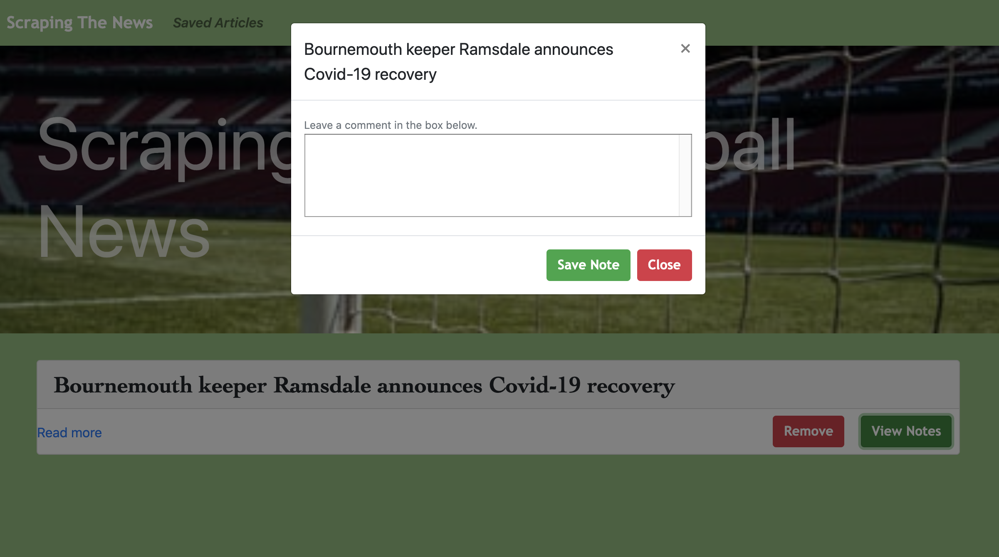

# Scraping-The-News 

## Overview
In this assignment, you'll create a web app that lets users view and leave comments on the latest news. But you're not going to actually write any articles; instead, you'll flex your Mongoose and Cheerio muscles to scrape news from another site.

[Link to page](https://secret-eyrie-74619.herokuapp.com/)

### Instructions

I. Whenever a user visits the site, the app scrapes stories from bbc.com and displays news from the site, specifically (Europe Football). 

II. Users should also are able to leave comments on the articles displayed and revisit them later. Users are also be able to delete comments left on articles. All stored comments should be visible to every user.
### Main Page

### Comment Page

## Tech Used
1. _MongoDB,Express, NodeJS_.
2. _NPM: Axios, cheerio, handlebars, body-parser_.
3. _jQuery, Bootstrap_
